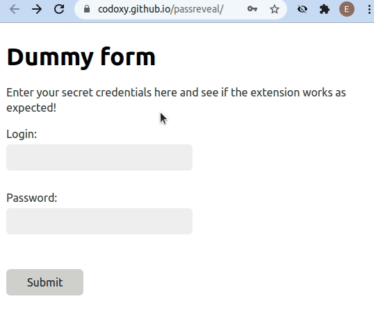

# Password Revealer

A simple Chrome extension that reveals any password field found on the current page.

## Demo:

Test it on [this webpage](https://codoxy.github.io/passreveal/)



# Sources

- extension template: https://developer.chrome.com/docs/extensions/mv3/getstarted/
- action on click: https://developer.chrome.com/docs/extensions/reference/action/#injecting-a-content-script-on-click
- eye icon: https://fonts.google.com/icons?selected=Material+Icons&icon.query=eye

## Convert icon from SVG to PNG:

https://stackoverflow.com/questions/9530524/convert-svg-to-transparent-png-with-antialiasing-using-imagemagick/9570081

This was giving an ugly black border around the icon:

```sh
convert +antialias -density 1200 -background none -resize 128x128 eye.svg eye128.png
```

What works better is changing fill color of the SVG to white, and then running:

```sh
convert +antialias -density 1200 -background black -channel RGB -negate -transparent white -resize 128x128 eye.svg eye128.png
```

This converts SVG to PNG with high density, sets background to black, negates the image, then changes white to transparent and resizes to desired size.
